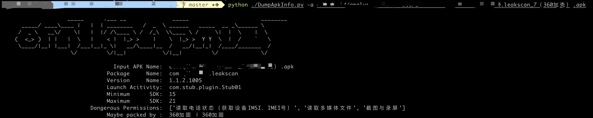

# DumpApkInfo
APK基本信息查看工具、可查看基本信息包括包名，入口类，所申明的敏感权限，以及常见厂商加固识别
# 使用方法
```
    
                    _____      .___ __              _____                      ________   
      _____/ ____\____ |   |  | ________   /  _  \ ______   _____  __ _\______ \  
     /  _ \   __\/    \|   |  |/ /\____ \ /  /_\  \\____ \ /     \|  |  \    |  \ 
    (  <_> )  | |   |  \   |    < |  |_> >    |    \  |_> >  Y Y  \  |  /    `   \
     \____/|__| |___|  /___|__|_ \|   __/\____|__  /   __/|__|_|  /____/_______  /
                     \/         \/|__|           \/|__|         \/             \/ 
    
                                                                
    USAGE:   python DumpApkInfo.py  -h
             python DumpApkInfo.py  -a app.apk

```
最终使用效果如下

# 写在最后
本项目基于@MagiCiAn表哥的[项目](https://github.com/MagiCiAn1/APKProtectionSearch)的基础上改写，修复了一些bug，并基于自己的工作需要，增加了自己的一些功能，大佬们觉得写的还可以的话，给个star?如果使用过程中有任何问题，欢迎提issue
